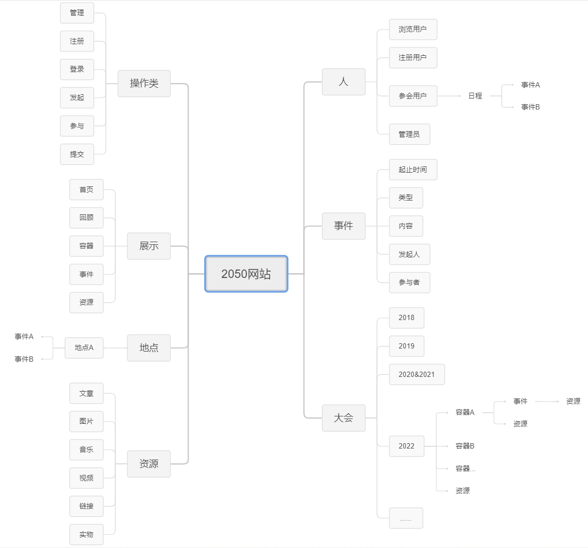
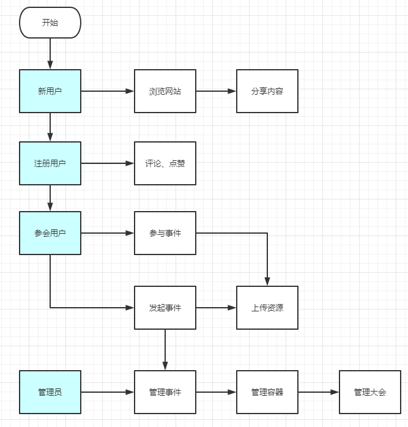
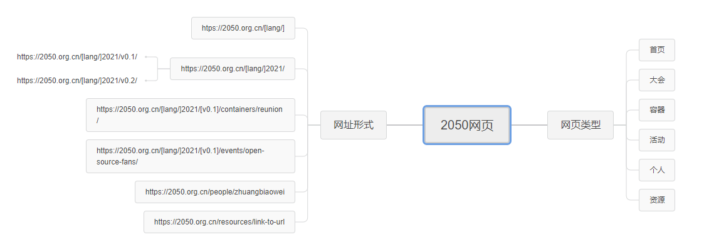
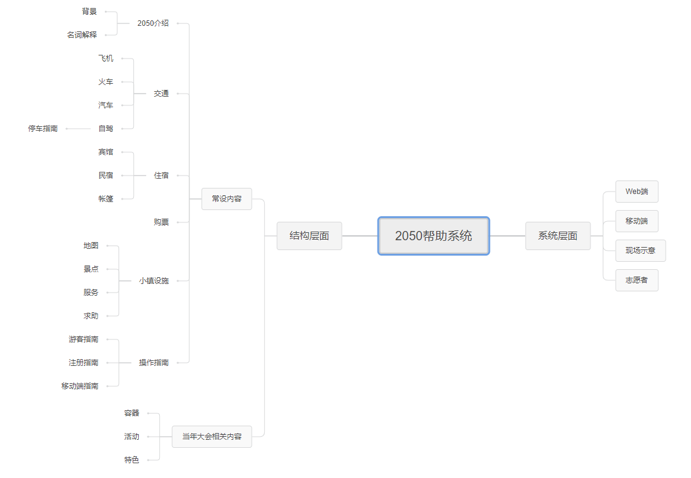
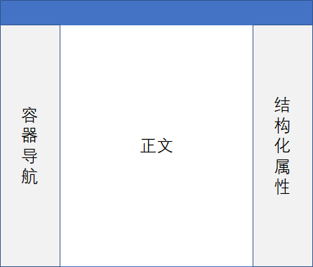
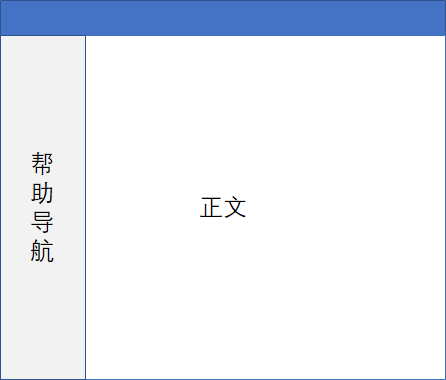
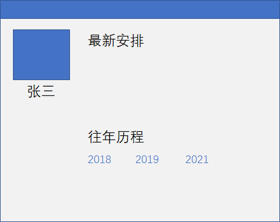

---
title: 产品需求文档
slug: /ProductDoc/index
---

# 产品需求文档

## 1. 2050网站数据结构脑图

在线脑图：[https://shimo.im/mindmaps/RHvX3Q3JjX9YDvCw](https://shimo.im/mindmaps/RHvX3Q3JjX9YDvCw)

## 事件&信息的完成度：
1. 新建阶段（我要发起一个活动/容器）
    * 属于XX容器/大会；名称；简介；类别
2. 草稿阶段（我要把这个简介，发给我的朋友review）
    * 我的朋友可以给我的这个简介，提供修改建议
3. 正式发起阶段（所有人都可以参加）
    * 所有XXXX年度的参会者，可以表示，自己要参加这个活动
4. 定档阶段（管理员确认，活动的时间、地点、人数上限等等）
    * 依然可以报名
5. 活动进行时
    * 申请参加截止
6. 活动回顾
    * 所有参与者，有权限在这个活动下，上传自己拍摄、记录的音视频资源，上传自己关于本次活动的分享文章等等

## 2. 工作流图

## 3. 网站的页面类型与URL约定

在线脑图：[https://shimo.im/mindmaps/Yw9c9Wwq9KctjXVj](https://shimo.im/mindmaps/Yw9c9Wwq9KctjXVj)

### 多语言问题：

经过与小乌云的讨论，决定依然采用/en、/zh 的方式，划分不同的语言，并在页面顶部提供语言切换。

另外，个人页与资源页，不提供多语言的切换。

## 4. 帮助系统

在线脑图：[https://shimo.im/mindmaps/gKXpG9Cg9cRphHKP](https://shimo.im/mindmaps/gKXpG9Cg9cRphHKP)

## 5. 页面布局

### 首页布局

顶部导航锁定，加正文无限下拉。具体可以参考：[https://coscup.org/2021/zh-TW/landing](https://coscup.org/2021/zh-TW/landing)

### 正文布局

在结构化属性的下方，根据具体内容，与用户权限，会出现不同的功能按钮，比如：点赞，我要参加，我要发起活动等等。

### 帮助布局

### 个人布局

