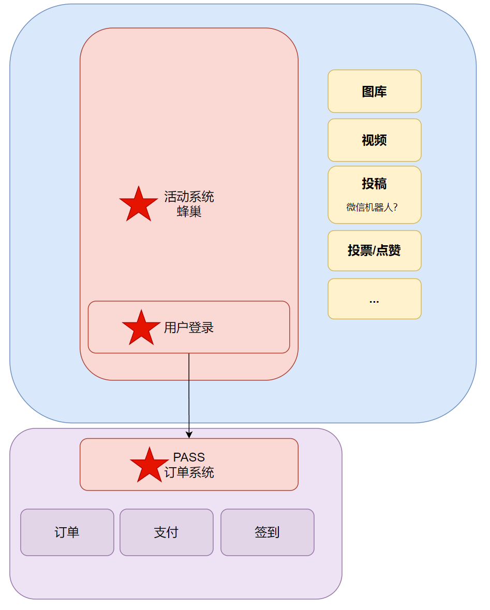
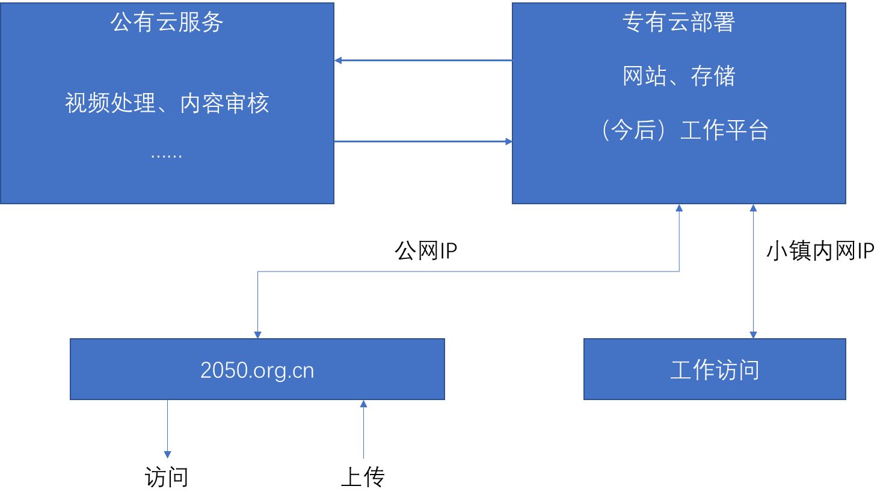

# 2050网站需求概述

## 模块实现的优先级说明

1. P-1：1月1日之前，可以在测试网站里面看到首页和用户。
1. P0：第一期是最基本的功能，能够让人来（注册登录购买pass，蜂巢），能够让人把来了要做什么说清楚（活动页面）。这一期，主要是从各大容器召集人的视角，让2050能办起来。2月1日完成。
1. P1：第二期，是让活动召集更容易（暂时只是先用简单的攻略和活动页面留言来搞定）、活动后的沉淀更有质量（暂时只是简单的文件上传和呈现）。这部分需要各活动召集人的视角。3月1日完成。
1. P2：第三期，让人们来了后玩得更high、碰撞出更多火花。这个涉及到网站上用户之间的互动功能，需要各种自愿者的视角。4月1日完成。
1. P3：有兴致了可以做一做。

关键页面：个人页、蜂巢页、活动页、首页

## 网站架构

## 部署位置

