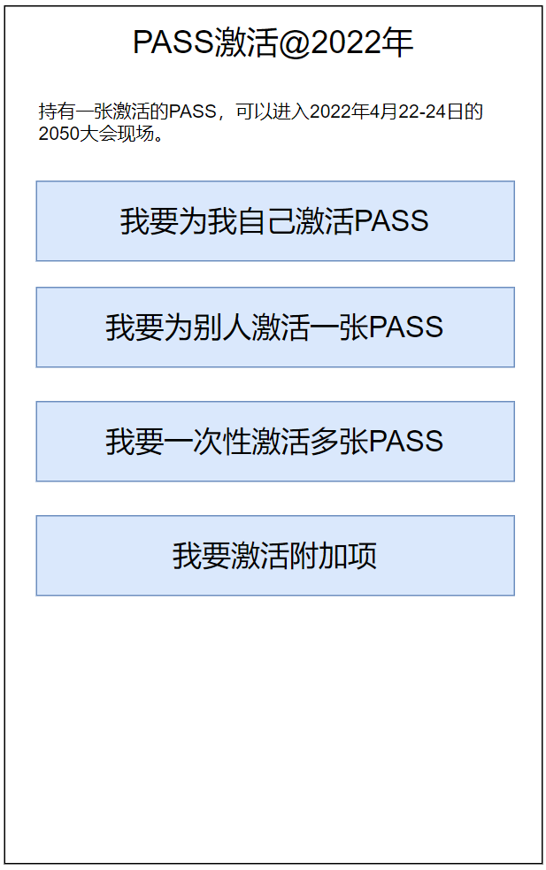

# PASS激活（下单订购）流程

每年4月底，三天的2050大会，每一个进场的人都拥有一个PASSID作为身份标识。这一个PASSID是：

1. 被付费激活过的（3日330元或2日660元）
1. 能够对应到持有者的身份证或护照号码
1. 跟持有者姓名一起被激光打印在一个金属牌子上
1. 同时也可以激活逐日晨跑、星空露营等付费的附加项
1. 同时也可以用来登录2050网站

付费激活并无线下入口，只有一个唯一的线上入口，即[getmypass.2050.org.cn](https://getmypass.2050.org.cn)。

一个用户首先必须登录2050网站，然后才能激活PASS。

其中，激活PASS动作分两种情况：

1. 用户付费激活自己的PASS
1. 用户付费激活别人的PASS

第二种情况常见于自愿者带来子女/父母/亲戚朋友、或者公司组织员工、学校组织师生一起来参加2050的场景。因此，批量激活多张PASS也是常见的需求。

现将PASS激活入口页面设计如下：

## PASS激活入口页面

## 为自己激活PASS

## 为别人激活一张PASS

## 批量激活多张PASS