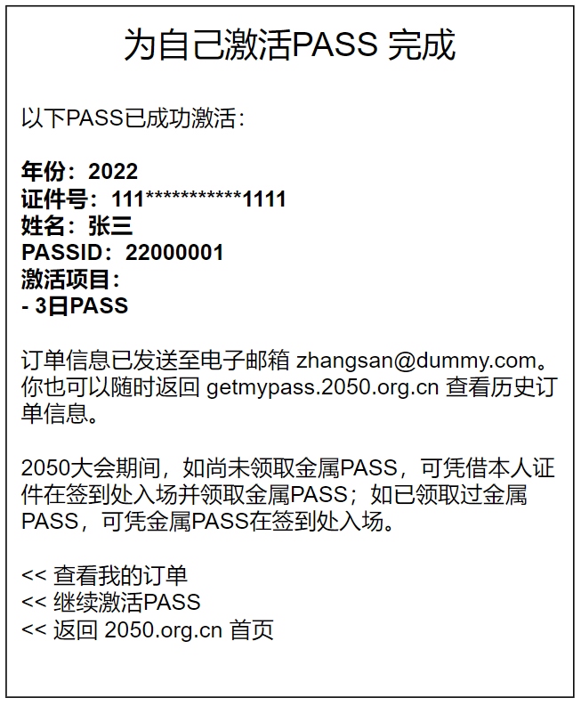

# PASS激活（下单订购）流程

## 作为大会进场凭证的PASS

每年4月底，三天的2050大会，每一个进场的人都拥有一个PASSID作为身份标识。这一个PASSID是：

1. 被付费激活过的（3日330元或2日660元）
1. 能够对应到持有者的身份证或护照号码
1. 跟持有者姓名一起被激光打印在一个金属牌子上
1. 同时也可以激活逐日晨跑、星空露营等付费的附加项
1. 同时也可以用来登录2050网站

从国家法律法规而言，[《群众性文化体育活动治安管理办法》](http://www.gov.cn/gongbao/content/2000/content_60116.htm)当中要求对于入场票证的管理、查验措施，在2050大会所对应的这个“入场票证”，实际可以对应到付费激活的每一张具体订单。

付费激活并无线下入口，只有一个唯一的线上入口[getmypass.2050.org.cn](https://getmypass.2050.org.cn)。

一个用户首先需要登录2050网站，然后才能进行激活PASS的操作。

其中，激活PASS的操作分两种情况：

1. 用户付费激活自己的PASS
1. 用户付费激活别人的PASS

第二种情况常见于自愿者带来子女/父母/亲戚朋友、或者公司组织员工、学校组织师生一起来参加2050的场景。因此，批量激活多张PASS也是常见的需求。

现将PASS激活入口页面设计如下：

## 为自己激活PASS

支付完成后的返回信息：

## 为别人激活一张PASS

注意：仅在“为别人激活PASS”且“该身份证没有历史订单”的情况下，才会触发“支付完成后自动生成一个新的PASSID+初始登录密码”的动作，从而需要将该“新的PASSID+初始登陆密码”信息告知代购人。

这里需要注意的另一点是，即使代购人填写了被代购人的电话号码和电子邮箱，我们也仍然需要将“新的PASSID+初始登陆密码”信息同步发送给代购人，因为**只有代购人的手机号码是经过验证确保有效的**，被代购人的手机号码则无法保证其有效性。

## 批量激活多张PASS