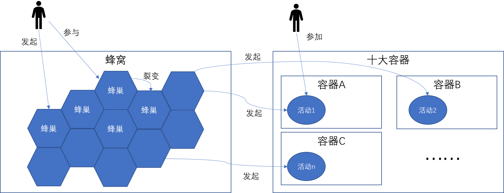
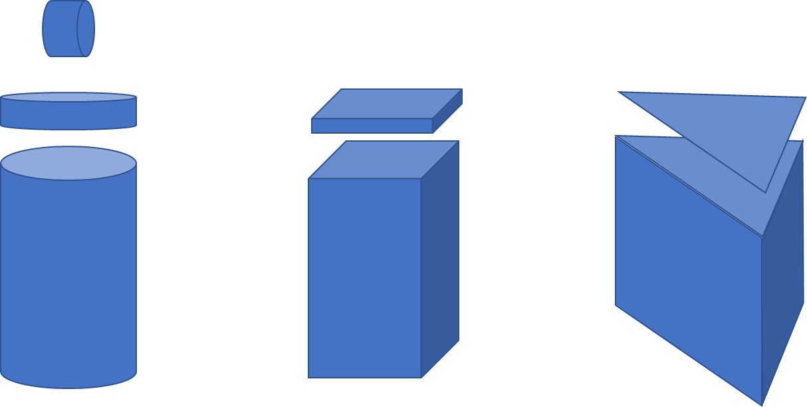
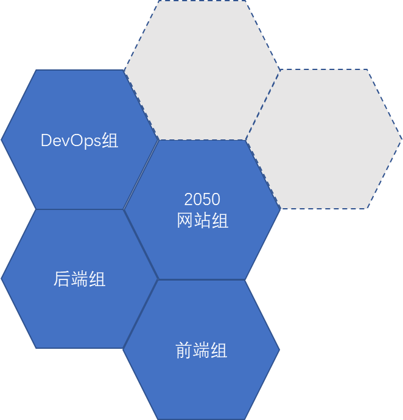

# 蜂巢与容器

## 蜂巢与容器与活动的关系

- 一个人能够发起一个蜂巢
- 一个人也能够参与一个蜂巢
- 一蜂巢中的参与者，可以裂变出另一个蜂巢
- 一个蜂巢可以发起一个以上的活动
- 每一个活动都属于某一个容器

## 理解容器

- 不同的容器，可以容纳不同类型的活动，有些“不完全符合的类型”，也可以加入某个容器
- 活动类型的差别，主要在于：人员、场地、时间，以及其他差异（备注表示）
- 比如：有些活动有人员上限（<100人）；有些活动有选择参与（思想约会，30人抽取3~5人）；有些没有人员邀请（百城味道，不用报名，随到随吃）
- 比如：有些活动有场地要求（一间教室，一个会议室，一个操场，3㎡展区），有些没有场地要求（思想约会，知道在哪里找到人就行）
- 比如 ：有些活动有时间要求（早上10~12点），有些时间是开区间（周六晚上8点以后，通宵Party）

## 理解蜂巢

- 一个蜂巢，是一个紧密联系的小组，5~6人是一个中位数。
	- 共同目标，各自分工，能够互相补位，形成一种“支撑结构”
	- 每一个边，代表一个人
	- 以谢孟军为例，他既是网站组的核心成员，又是后端组的召集人
- 以上的图，虽然是一个二维平面，但事实上一个人可能同时出现在N个蜂巢，作为其中的召集人或核心成员
- 所谓裂变，就是某一个蜂巢的参与者，成为另一个新的蜂巢的召集人，并且开始做其他的一些工作。这些工作，也许原有的2050网站这个工作有关，也可能无关。
- 在2050网站之外，有很多种情况，形成了一个一个蜂巢，这些蜂巢的信息，在2050网站上沉淀下来。但是：形成的过程，不需要在2050网站上体现

## 对于网站UI的定位

1. 这是一个全球性的网站，需要考虑整个网站的吸引力与接受度
2. 主视觉先不做大的创新，先基于现有的网站，做一定的改进
